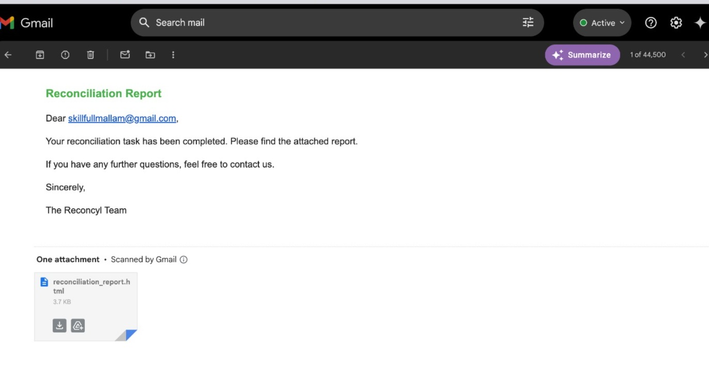
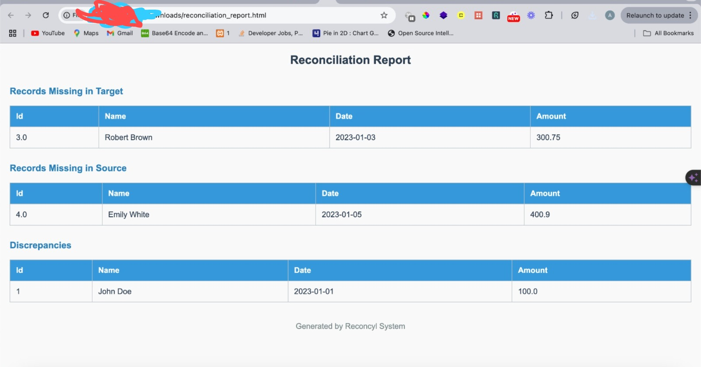

# Reconcyl

**Reconcyl** is a Django-based project with a REST API that handles file uploads for reconciliation processing. The API accepts two CSV files (source and target) and processes the reconciliation in the background using Celery and Redis. The API provides detailed reconciliation reports in JSON, CSV, or HTML format.


## Screenshots

### Email Screenshot


### Report Screenshot


## Features

- Upload two CSV files for reconciliation (source and target).
- Perform data normalization to handle:
  - Case sensitivity
  - Date formats
  - Leading/trailing spaces
- Identify records missing in either file.
- Highlight discrepancies in records that exist in both files.
- Background processing of reconciliation using Celery and Redis for scalability.
- Retrieve reconciliation results in different formats (CSV, JSON, HTML).
- Robust error handling for file upload and processing failures.

# Reconciliation Process

Upload CSV Files: Use the /upload/ endpoint to upload the source and target CSV files for reconciliation. You can also specify an optional email and report_format (json, csv, or html).

Check Task Status: After uploading the files, you will receive a task_id. You can check the status of the task at the /reconciliation/<task_id>/ endpoint.

Download the Report: Once the task is complete, you can download the report in the desired format by appending the format parameter (json, csv, or html) to the URL:

bash

GET /reconciliation/<task_id>/?format=html

# Sending Email Reports

Reconcyl automatically sends an email containing the reconciliation report in the requested format if the email field is provided during file upload.


## Potential Improvements

Chunk Processing: For large datasets, split the CSV files into manageable chunks and process each chunk asynchronously, then combine the results.
Task Queue Prioritization: Use Celery’s task prioritization feature to handle smaller tasks faster while large tasks run in the background.
Async I/O: Consider using asynchronous I/O libraries like aiohttp for faster file reading and API calls, allowing tasks to be processed concurrently without blocking.
   ```bash
   celery -A reconcyl worker --loglevel=info
   ```
## Technologies

- **Python** (Django, Django REST Framework)
- **Celery** for background task processing
- **Redis** as the message broker
- **Pandas** for CSV file processing
- **Postman** for API testing

## Prerequisites

Ensure you have the following installed:

- Python 3.8+
- Redis (for Celery)
- A virtual environment setup (recommended)

## Installation

1. **Clone the repository**:

   ```bash
   git clone https://github.com/lafiagi/reconcyl.git
   cd reconcyl
   ```

2. **Set up a virtual environment**:

   ```bash
   python3 -m venv venv
   source venv/bin/activate   # On Windows: venv\Scripts\activate
   ```

3. **Install dependencies**:

   ```bash
   pip install -r requirements.txt
   ```

4. **Set up environment variables**:

   Create a `.env` file in the root directory:

   ```bash
   touch .env
   ```

   Add the following environment variables to the `.env` file:

   ```bash
    SECRET_KEY=your-securekey
    DEBUG=True
    ALLOWED_HOSTS="your allowed hosts"
    DATABASE_URL="url db url string"
    CELERY_BROKER_URL = 'broker url'
    CELERY_RESULT_BACKEND ="celerey backend"
    MAILGUN_BASE_URL=your_mailgun_key
    MAILGUN_API_KEY=key-your-key
   ```

5. **Configure Redis**:

   Ensure Redis is installed and running on your local machine. You can install Redis by following the official guide [here](https://redis.io/download).
   run `redis-server` on your terminal start the server

6. **Apply migrations**:

   ```bash
   python3 manage.py migrate
   ```

7. **Run the Django development server**:

   ```bash
   python3 manage.py runserver
   ```

8. **Start Celery Worker**:

   In another terminal window, start the Celery worker:

   ```bash
   celery -A reconcyl worker --loglevel=info
   ```

   You should see Celery workers starting up and waiting for tasks.

## Running Tests

To run tests:

```bash
python3 manage.py test
```

Ensure that Celery and Redis are running before starting the tests, as they are required for task execution.

## Deployment

1. **Set up environment variables** Add sensitive data such as `SECRET_KEY`, `DEBUG`, and `ALLOWED_HOSTS` into the `.env` file.
2. Ensure Redis is configured and running.
3. Start Celery with:

   ```bash
   celery -A reconcyl worker --loglevel=info
   ```

4. Use a production-ready database such as PostgreSQL or MySQL for scaling we are using sqlite3 for testing.

## Project Structure

```
reconcyl/
│
├── reconcyl/                 # Project settings
│   ├── __init__.py
│   ├── settings.py
│   ├── urls.py
│   ├── wsgi.py
│
├── reconciliation/           # Core app for reconciliation processing
│   ├── migrations/
│   ├── __init__.py
│   ├── admin.py
│   ├── apps.py
│   ├── models.py
│   ├── serializers.py
│   ├── tasks.py              # Celery task for reconciliation
│   ├── views.py
│
├── manage.py                 # Django management command
├── .env                      # Environment variables
├── requirements.txt          # Dependencies
└── README.md                 # This file
```

## Acknowledgements

- [Django REST Framework](https://www.django-rest-framework.org/)
- [Celery](https://docs.celeryproject.org/)
- [Redis](https://redis.io/)
- [Pandas](https://pandas.pydata.org/)